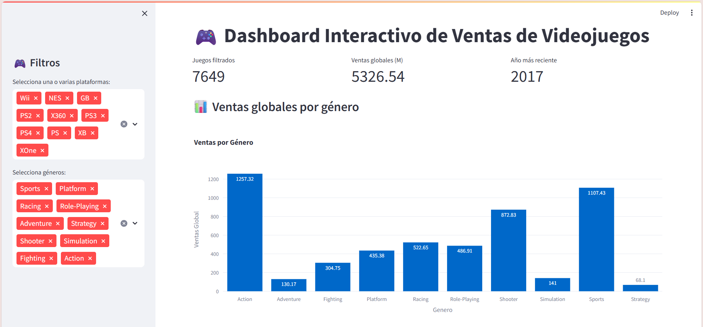

# 🎮 Análisis Predictivo de Videojuegos con Machine Learning

[](https://www.python.org/downloads/)
[](https://streamlit.io/)
[](LICENSE)

Proyecto de Ciencia de Datos que utiliza **Machine Learning** para predecir el éxito comercial de videojuegos basándose en datos históricos (1980-2016).

🔗** | 📊 **[Reporte Ejecutivo](Proyecto Final_Videojuegos.pdf)**



---

## 📋 Tabla de Contenidos

- [Descripción del Proyecto](#-descripción-del-proyecto)
- [Características](#-características)
- [Tecnologías Utilizadas](#-tecnologías-utilizadas)
- [Instalación](#-instalación)
- [Uso](#-uso)
- [Resultados Clave](#-resultados-clave)
- [Estructura del Proyecto](#-estructura-del-proyecto)
- [Autor](#-autor)

---

## 🎯 Descripción del Proyecto

Este proyecto analiza **16,326 videojuegos** lanzados entre 1980 y 2016 para responder la pregunta:

> **¿Qué factores determinan el éxito comercial de un videojuego?**

### Objetivos:

1. **Predecir** la categoría de éxito (Fracaso, Moderado, Éxito, Blockbuster) usando Random Forest
2. **Identificar** patrones de juegos similares mediante clustering K-Means
3. **Analizar** la evolución temporal del mercado (series de tiempo)
4. **Visualizar** hallazgos en un dashboard interactivo con Streamlit

---

## ✨ Características

### 🤖 Modelo de Clasificación
- **Algoritmo:** Random Forest Classifier
- **Precisión:** 68.18% (Cross-validation: 67%)
- **Categorías:** 4 niveles de éxito basados en ventas
- **Predictor interactivo** en el dashboard

### 🔬 Clustering de Juegos
- **Algoritmo:** K-Means (5 clusters)
- Identifica 5 arquetipos de juegos:
  - Mega-blockbusters (28 juegos, 25M promedio)
  - Éxitos AAA (429 juegos, 5M promedio)
  - 3 clusters mainstream/nicho

### 📈 Análisis de Series de Tiempo
- Evolución de ventas globales (1980-2016)
- Análisis regional (Norteamérica, Europa, Japón)
- Identificación de peak histórico: **2008 con 679M ventas**

### 📊 Dashboard Interactivo
- Filtros dinámicos por era, género, plataforma, año
- 10+ visualizaciones interactivas con Plotly
- Predictor de éxito en tiempo real
- Descarga de datos procesados

---

## 🛠 Tecnologías Utilizadas

### Lenguajes y Frameworks
- **Python 3.11**
- **Streamlit** (Dashboard web)
- **Pandas & NumPy** (Manipulación de datos)
- **Scikit-learn** (Machine Learning)
- **Plotly** (Visualizaciones interactivas)
- **Matplotlib & Seaborn** (Gráficas estáticas)

### Modelos de ML
- Random Forest Classifier (200 árboles, profundidad 20)
- K-Means Clustering (5 clusters)
- Label Encoding para variables categóricas
- StandardScaler para normalización

---

## 🚀 Instalación

### Requisitos Previos
- Python 3.11 o superior
- pip (gestor de paquetes)

### Paso 1: Clonar el repositorio
```bash
git clone https://github.com/karenhernandezpr-bit/Dashboard_Videojuegos.git
cd Dashboard_Videojuegos
```

### Paso 2: Crear entorno virtual (opcional pero recomendado)

```bash
python -m venv venv

# Windows
venv\Scripts\activate

# Mac/Linux
source venv/bin/activate
```

### Paso 3: Instalar dependencias

```bash
pip install -r requirements.txt
```

### Paso 4: Descargar el dataset

El archivo `Ventas+Videojuegos.xlsx` debe estar en la carpeta raíz.

---

## 📖 Uso

### 1. Ejecutar Análisis Completo

Genera modelos, visualizaciones y datos procesados:

```bash
python analisis_completo.py
```

**Salidas generadas:**
- `modelo_entrenado.pkl` (modelos de ML)
- `datos_procesados.csv` (dataset limpio)
- `visualizaciones/` (8 gráficas PNG)

### 2. Lanzar Dashboard de Streamlit

```bash
streamlit run app_streamlit.py
```

El dashboard se abrirá automáticamente en `http://localhost:8501`

---

## 🏆 Resultados Clave

### Factores de Éxito (Importancia en el modelo)

| Factor | Importancia | Insight |
|--------|-------------|---------|
| **Año** | 31.6% | El timing es el factor más crítico |
| **Editorial** | 30.8% | Respaldo de publishers prestigiosos multiplica éxito |
| **Género** | 22.3% | Action y Sports dominan ventas |
| **Plataforma** | 15.4% | PS2, Wii, X360 fueron las más exitosas |

### Distribución Geográfica

- 🇺🇸 **Norteamérica:** 49.1% (4,333M ventas)
- 🇪🇺 **Europa:** 27.3% (2,409M ventas)
- 🇯🇵 **Japón:** 14.6% (1,284M ventas)
- 🌍 **Otros:** 8.9% (789M ventas)

### Categorías de Éxito

- **Fracaso** (<0.5M): 75.7% de juegos
- **Moderado** (0.5-1M): 11.7%
- **Éxito** (1-3M): 9.8%
- **Blockbuster** (>3M): 2.9%

> 💡 Solo 1 de cada 34 juegos se convierte en blockbuster

---

## 📁 Estructura del Proyecto

```
videojuegos-ml-analysis/
├── analisis_completo.py           # Script principal de análisis
├── app3.py                # Dashboard interactivo
├── Ventas+Videojuegos.xlsx         # Dataset original
├── requirements.txt                # Dependencias
├── README.md                       # Este archivo
├── Proyecto Final_Videojuegos.pdf           # Reporte ejecutivo (3 páginas)
│
├── modelo_entrenado.pkl            # Modelos entrenados (generado)
├── datos_procesados.csv            # Dataset limpio (generado)
│
└── visualizaciones/                # Gráficas generadas
    ├── 01_distribucion_categorias.png
    ├── 02_matriz_confusion.png
    ├── 03_importancia_variables.png
    ├── 04_metodo_codo.png
    ├── 05_clusters_visualizacion.png
    ├── 06_serie_tiempo.png
    ├── 07_generos_por_era.png
    └── 08_distribucion_geografica_exito.png
```

---

## 📊 Visualizaciones Incluidas

El proyecto genera 8 visualizaciones de alta calidad:

1. **Distribución de Categorías de Éxito** - Barras mostrando % de cada categoría
2. **Matriz de Confusión** - Precisión del modelo por categoría
3. **Importancia de Variables** - Factores que determinan éxito
4. **Método del Codo** - Selección óptima de K en clustering
5. **Clusters de Juegos** - Scatter plot de grupos similares
6. **Series de Tiempo** - Evolución de ventas globales y regionales
7. **Géneros por Era** - Cambios en preferencias a través del tiempo
8. **Distribución Geográfica** - Tortas de ventas por región y categoría

---

## 🔮 Predictor de Éxito

El dashboard incluye un **predictor interactivo** donde puedes ingresar:

- Género del juego
- Plataforma de lanzamiento
- Editorial
- Año de lanzamiento

Y obtener:
- Categoría predicha (Fracaso/Moderado/Éxito/Blockbuster)
- Probabilidad de cada categoría
- Análisis contextual vs. datos históricos

---

## 📝 Notas Importantes

### Limitaciones del Modelo

1. **Datos hasta 2016:** No incluye era actual de Game Pass, F2P, móviles
2. **Ventas físicas únicamente:** Omite descargas digitales (creciente desde 2010)
3. **Factores externos no capturados:** Calidad del juego, presupuesto de marketing, reviews
4. **Precisión 68%:** Útil para screening inicial, no para decisiones finales

### Mejoras Futuras

- Actualizar con datos 2017-2024
- Incorporar ventas digitales
- Agregar features: presupuesto, Metacritic score, franquicias
- Modelo de regresión para predecir ventas exactas

---

## 👨‍💻 Autor

**[Karen Alexxa Hernández Preza]**

- 📧 Email: karen.hernandezpr@anahuac.mx

- 🐙 GitHub: [karenhernandezpr-bit](https://github.com/karenhernandezpr-bit)

---

## 📄 Licencia

Este proyecto está bajo la Licencia MIT. Ver el archivo [LICENSE](LICENSE) para más detalles.

---

## 🙏 Agradecimientos

- Dataset original de [Kaggle](https://www.kaggle.com/)
- Comunidad de Streamlit por la excelente documentación
- Scikit-learn por las herramientas de ML

---

---

⭐ **Si este proyecto te fue útil, dale una estrella en GitHub!** ⭐